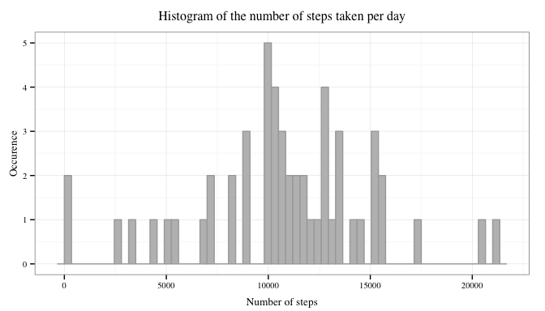
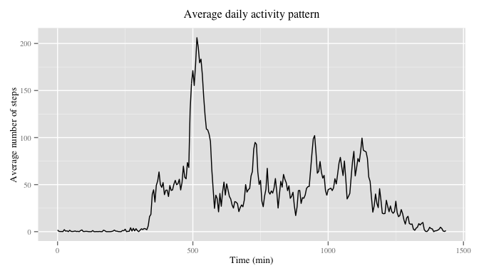
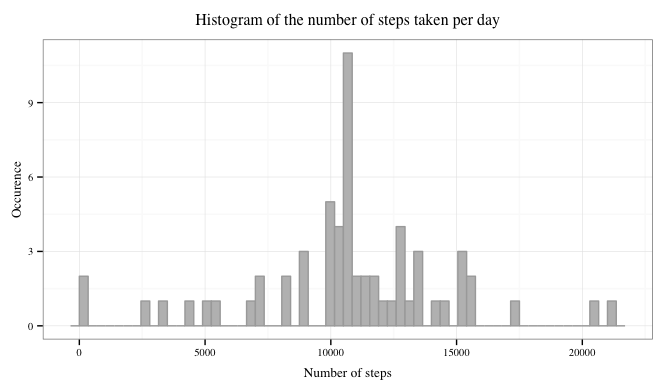
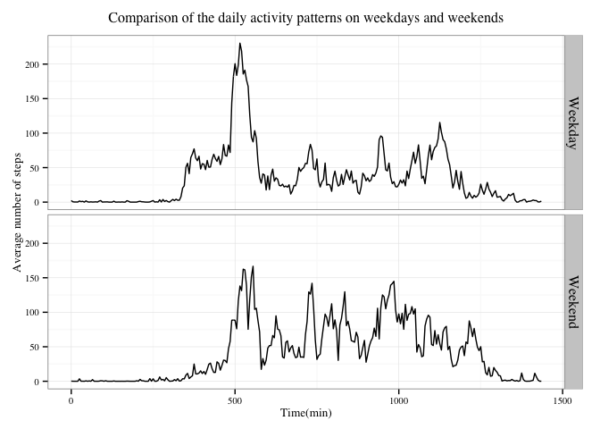

# Reproducible Research: Peer Assessment 1
###Introduction  

The data used for this project comes from a personal activity monitoring device. It contains the number of steps taken in 5-minute intervals throughout the day by a single individual during two months in 2012.
The compressed dataset can be downloaded from [here]((https://d396qusza40orc.cloudfront.net/repdata%2Fdata%2Factivity.zip)).

This project aims at answering the following questions:   
- On average, how many steps does this individual take in one day?  
- On average, at what time of the day is that person most active?  
- Do they have different activity patterns on weekdays and weekends?  


### Loading and preprocessing the data 

The data are provided in a compressed file.   

Loading the data:
should I put code to download and unzip the file?

```r
data<-read.csv("activity.csv") #other options such as stringsAsFactors=FALSE)
summary(data)
```

```
##      steps                date          interval     
##  Min.   :  0.00   2012-10-01:  288   Min.   :   0.0  
##  1st Qu.:  0.00   2012-10-02:  288   1st Qu.: 588.8  
##  Median :  0.00   2012-10-03:  288   Median :1177.5  
##  Mean   : 37.38   2012-10-04:  288   Mean   :1177.5  
##  3rd Qu.: 12.00   2012-10-05:  288   3rd Qu.:1766.2  
##  Max.   :806.00   2012-10-06:  288   Max.   :2355.0  
##  NA's   :2304     (Other)   :15840
```


```r
library(dplyr)
library(ggplot2)
```

There is a problem with the original data: the intervals skip from 55 to 100, 155 to 200 etc., as a result there is a 45-min long interval at the end of each hour.
There should only be 1440 min in 1 day, not 2355.
So, with the code below, I make a new variable by creating the correct sequence of number from 0 to 1435 with an interval of 5.


```r
int<-seq(0,1435,by=5)
activity<-cbind(data, int)
activity<-select(activity, -interval)
```

Convert the date variable from factors to dates

```r
activity$date<-as.Date(activity$date,"%Y-%m-%d")
```


### What is mean total number of steps taken per day?

Total number of steps taken each day:

```r
total_steps<-aggregate(steps~date,data=activity,FUN=sum)
```
To adjust the number of breaks of the histogram, the range of the values is computed:

```r
range(total_steps$steps)
```

```
## [1]    41 21194
```

Histogram to show the distribution of the data

```r
g<-ggplot(total_steps, aes(steps))
g+geom_histogram(fill="gray", color="darkgray", binwidth=350)+theme_bw(base_family="Times", base_size=10)+labs(title="Total number of steps per day", x="Number of steps",y="Occurence")+theme(plot.title=element_text(vjust=1.5), axis.title.x=element_text(vjust=-0.2), axis.title.y=element_text(vjust=0.75))
```



Computation of the mean and median values of the total number of steps taken each day.  


```r
mean_step<-mean(total_steps$steps, na.rm=TRUE)
med<-median(total_steps$steps, na.rm=TRUE)
```
On average, 10766.19 steps were taken every day. The median value is 10765.00.  


### What is the average daily activity pattern?

Compute the average number of steps taken par interval across all days:

```r
steps_by_interval<-aggregate(steps~int,data=activity,FUN=mean)
head(steps_by_interval)
```

```
##   int     steps
## 1   0 1.7169811
## 2   5 0.3396226
## 3  10 0.1320755
## 4  15 0.1509434
## 5  20 0.0754717
## 6  25 2.0943396
```
Plot time series

```r
ggplot(steps_by_interval, aes(int, steps))+geom_line()+labs(title="Average daily activity pattern", x="Time (min)",y="Average number of steps")+theme_gray(base_family="Times", base_size=10)+theme(plot.title=element_text(vjust=1.5))
```



To determine the interval with the maximum activity

```r
maxi<-max(steps_by_interval$steps)
maxi_int<-steps_by_interval[steps_by_interval$steps==maxi,]
print(maxi_int)
```

```
##     int    steps
## 104 515 206.1698
```
The time of the day with the maximum activity is the 515th interval, which corresponds to 8.35am. 
That seems plausible: could correspond to the time when that person walks to work or school.

## Imputing missing values


```r
missing<-activity[is.na(activity),]
nb<-nrow(missing)
```
There are 2304 missing values. 

To fill the missing values in the data set, the mean number of steps taken during each interval is used

```r
new_data<-merge(missing, steps_by_interval,"int")
head(new_data)
```

```
##   int steps.x       date  steps.y
## 1   0      NA 2012-10-01 1.716981
## 2   0      NA 2012-11-30 1.716981
## 3   0      NA 2012-11-04 1.716981
## 4   0      NA 2012-11-09 1.716981
## 5   0      NA 2012-11-14 1.716981
## 6   0      NA 2012-11-10 1.716981
```

```r
tail(new_data)
```

```
##       int steps.x       date  steps.y
## 2299 1435      NA 2012-11-01 1.075472
## 2300 1435      NA 2012-10-08 1.075472
## 2301 1435      NA 2012-11-04 1.075472
## 2302 1435      NA 2012-11-09 1.075472
## 2303 1435      NA 2012-10-01 1.075472
## 2304 1435      NA 2012-11-30 1.075472
```

```r
new_data<-select(new_data,-steps.x)
new_data<-rename(new_data, steps=steps.y)
```
Remove rows with NAs from activity, join that dataset with new_data

```r
complete<-filter(activity,!is.na(steps))
full_data<-rbind(complete,new_data)
#order the rows based on the date and the interval:
full_data<-arrange(full_data,date,int)
#View the result
full_data<-tbl_df(full_data)
full_data
```

```
## Source: local data frame [17,568 x 3]
## 
##        steps       date int
## 1  1.7169811 2012-10-01   0
## 2  0.3396226 2012-10-01   5
## 3  0.1320755 2012-10-01  10
## 4  0.1509434 2012-10-01  15
## 5  0.0754717 2012-10-01  20
## 6  2.0943396 2012-10-01  25
## 7  0.5283019 2012-10-01  30
## 8  0.8679245 2012-10-01  35
## 9  0.0000000 2012-10-01  40
## 10 1.4716981 2012-10-01  45
## ..       ...        ... ...
```
Using this new full data set, make a histogram of the total number of steps taken each day

```r
#1. Compute the sum for each day
full_steps<-aggregate(steps~date,data=full_data,FUN=sum)

#2. make the histogram
ggplot(full_steps, aes(steps))+geom_histogram(fill="gray", color="darkgray", binwidth=350)+theme_bw(base_family="Times", base_size=10)+labs(title="Total number of steps per day", x="Number of steps",y="Occurence")+theme(plot.title=element_text(vjust=1.5), axis.title.x=element_text(vjust=-0.2), axis.title.y=element_text(vjust=0.75))
```



Computation of the mean and median values of the total number of steps taken each day.  


```r
full_mean_step<-mean(full_steps$steps)
full_med<-median(full_steps$steps)
```
On average, 10766.19 steps were taken every day. The median value is 10766.19.    
Comments: !!!!  
doesn't change the mean(that's normal, I added mean values), slightly changes the distribution. Normal distribution?  

## Are there differences in activity patterns between weekdays and weekends?

For this part the `weekdays()` function may be of some help here. Use
the dataset with the filled-in missing values for this part.

Create a new factor variable in the dataset with two levels -- "weekday" and "weekend" indicating whether a given date is a weekday or weekend day.


```r
#1. Use the weekdays() function to create a new variable "day" indicating the day of the week based on the date:

full_data<-mutate(full_data,day=weekdays(date))

#2. use a for loop with conditional statements to replace the names of days with weekday or weekend.

for (i in 1:nrow(full_data)){
        if (full_data$day[i] %in% c("Monday","Tuesday","Wednesday","Thursday","Friday")){
                full_data$day[i]<-"Weekday"
        }else{
                full_data$day[i]<-"Weekend"
        }
}

#Class of the created variable: character. Next step: convert it into a factor variable

full_data<-mutate(full_data,day=factor(day))
```

Make a panel plot containing a time series plot (i.e. `type = "l"`) of the 5-minute interval (x-axis) and the average number of steps taken, averaged across all weekday days or weekend days (y-axis).

```r
full_steps<-full_data%>%
        group_by(day,int)%>%
        summarise(avg_steps=mean(steps))
```


```r
ggplot(full_steps, aes(int,avg_steps))+geom_line()+facet_grid(day~.)+theme_bw(base_family="Times", base_size=10)+labs(title="Comparison of the daily activity patterns on weekdays and weekends", x="Time(min)", y="Average number of steps")+ theme(plot.title=element_text(vjust=1.5), strip.text.y=element_text(size=12))
```


