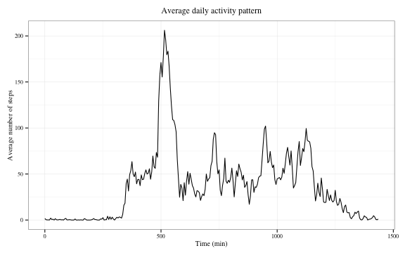
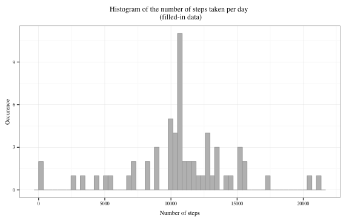

##Reproducible Research: Peer Assessment 1
==========================================
  
    
    
####Introduction  

The data used for this assignment were collected by a personal activity monitoring device. The dataset contains the number of steps taken in 5-minute intervals throughout the day by a single individual during two months in 2012.
The compressed dataset can be downloaded from [here](https://d396qusza40orc.cloudfront.net/repdata%2Fdata%2Factivity.zip). The method used in this case was to fork/clone [this Github repository](https://github.com/rdpeng/RepData_PeerAssessment1).  

This project aims at understanding this person's walking habits and answering the following questions:   
- On average, how many steps does this individual take in one day?  
- On average, at what time of the day is that person most active?  
- Do they have different activity patterns on weekdays and weekends?  

To do so, the programming language used was R (version 3.1.3) with OS X 10.7.5 as the operating system. This report was produced using RMarkdown and knitr in RStudio.

***
#### Loading and preprocessing the data   

After setting the working directory with `setwd()`, the following code was run to unzip and load the data.


```r
#the following code is cached so that it does not run every time the file is processed.
unzip("activity.zip")
data<-read.csv("activity.csv") #other options such as stringsAsFactor=FALSE are not necessary in this case
```

Two additional R packages are required to run the code:

```r
library(dplyr)
library(ggplot2)
```

There is an oddity in the original data: at the end of each hour, the time intervals skip from 55 to 100, 155 to 200 etc. As a result if we want to use these intervals as indicators of time, there is a 45-min long interval at the end of each hour. There are 1440 min in one day. So, I chose to replace the "interval" variable by an "int" variable made of the sequence of numbers from 0 to 1435 with an interval of 5.


```r
int<-seq(0,1435,by=5)
activity<-cbind(data,int)
activity<-select(activity, -interval)
```

The "date" variable is a factor and was converted into dates: 

```r
activity$date<-as.Date(activity$date,"%Y-%m-%d")
```

The dataset on which the analysis was run is summarized below:

```r
summary(activity)
```

```
##      steps             date                 int        
##  Min.   :  0.00   Min.   :2012-10-01   Min.   :   0.0  
##  1st Qu.:  0.00   1st Qu.:2012-10-16   1st Qu.: 358.8  
##  Median :  0.00   Median :2012-10-31   Median : 717.5  
##  Mean   : 37.38   Mean   :2012-10-31   Mean   : 717.5  
##  3rd Qu.: 12.00   3rd Qu.:2012-11-15   3rd Qu.:1076.2  
##  Max.   :806.00   Max.   :2012-11-30   Max.   :1435.0  
##  NA's   :2304
```

***

#### What is the mean total number of steps taken per day?

To compute the mean total number of steps taken each day, the data were grouped by date and then the sum() function was applied to the steps variable for each day. In this case, the missing values were ignored.  


```r
total_steps<-aggregate(steps~date,data=activity,FUN=sum)
#Note: by default, aggregate() ignores missing values
```

To show the distribution of the data, a histogram of the number of steps taken in a day was plotted:


```r
ggplot(total_steps, aes(steps))+geom_histogram(fill="gray", color="darkgray", binwidth=350)+theme_bw(base_family="Times", base_size=10)+labs(title="Histogram of the number of steps taken per day", x="Number of steps",y="Occurence")+theme(plot.title=element_text(vjust=1.5), axis.title.x=element_text(vjust=-0.2), axis.title.y=element_text(vjust=0.75))
```

 

The mean and median values of the total number of steps taken each day were calculated. 


```r
mean_step<-mean(total_steps$steps, na.rm=TRUE)
mean_step
```

```
## [1] 10766.19
```

```r
med<-median(total_steps$steps, na.rm=TRUE)
med
```

```
## [1] 10765
```
On average, 10766.19 steps were taken every day. The median value is 10765.00.  


***

#### What is the average daily activity pattern?

To determine the daily activity pattern, the average number of steps taken per interval across all days was computed. The following code groups the data by interval and compute the mean number of steps for each group of intervals.  


```r
steps_by_interval<-aggregate(steps~int,data=activity,FUN=mean)
head(steps_by_interval)
```

```
##   int     steps
## 1   0 1.7169811
## 2   5 0.3396226
## 3  10 0.1320755
## 4  15 0.1509434
## 5  20 0.0754717
## 6  25 2.0943396
```

The daily activity pattern is represented with this time series plot:


```r
ggplot(steps_by_interval, aes(int, steps))+geom_line()+labs(title="Average daily activity pattern", x="Time (min)",y="Average number of steps")+theme_bw(base_family="Times", base_size=10)+theme(plot.title=element_text(vjust=1.5))
```

 

To determine the interval with the maximum activity the following code was used:   


```r
maxi<-max(steps_by_interval$steps) #identify the maximum number of steps
maxi_int<-steps_by_interval[steps_by_interval$steps==maxi,] #return the corresponding row
maxi_int
```

```
##     int    steps
## 104 515 206.1698
```
On average, the 5-minute interval with the maximum activity is the 515th interval, which corresponds to 8:35-8:40 am and about 206 steps. 


***

#### Imputing missing values

The use of the `summary()`function on the full dataset showed that the "steps" variable was the only variable with missing values.
The following code creates a subset with only the rows containing NA values. The number of rows in this dataset correspond to the number of missing values in the original dataset. 


```r
missing<-activity[is.na(activity),]
nb<-nrow(missing)
```
There are 2304 missing values in the steps variable, representing 13.1% of the data. 

The choice was made to fill-in the missing values with the mean number of steps for the corresponding interval calculated across all days (ie the values calculated in the previous part). It is based on the assumption that this method, though imperfect, will not be too disruptive.

Two intermediary datasets were used:  
- the "missing" dataset, from the previous code chunk  
- the "steps_by_interval" dataset, containing the mean number of steps for each interval.  


```r
new_data<-merge(missing, steps_by_interval,"int") #1 see below the explanation
new_data<-select(new_data,-steps.x) #2
new_data<-rename(new_data, steps=steps.y) #3
```


```r
complete<-filter(activity,!is.na(steps)) #4
full_data<-rbind(complete,new_data) #5
full_data<-arrange(full_data,date,int) #6
```
1. Merge the missing dataset with step_by_interval. The interval variable is used for the merging, thus the mean value for each interval is added to the missing dataset.  
2. Remove the extra column created. 
3. Make sure that the new dataset has the right variable names (the same as the main dataset)  
4. Remove in the main dataset the rows with NA values.  
5. Remake a full dataset: all the rows removed at the previous line are         replaced by new rows containing the mean values.  
6. Order the new dataset by date and interval.    

In the original dataset, the data for the first day are missing. Thus, looking at the head of the new dataset shows an exemple of what was done for that first day:

```r
head(full_data)
```

```
##       steps       date int
## 1 1.7169811 2012-10-01   0
## 2 0.3396226 2012-10-01   5
## 3 0.1320755 2012-10-01  10
## 4 0.1509434 2012-10-01  15
## 5 0.0754717 2012-10-01  20
## 6 2.0943396 2012-10-01  25
```

The distribution of the filled-in dataset is plotted with the following histogram:  

```r
#1. Compute the sum of steps for each day
full_steps<-aggregate(steps~date,data=full_data,FUN=sum)

#2. plot the histogram
ggplot(full_steps, aes(steps))+geom_histogram(fill="gray", color="darkgray", binwidth=350)+theme_bw(base_family="Times", base_size=10)+labs(title="Histogram of the number of steps taken per day \n (filled-in data)", x="Number of steps",y="Occurence")+theme(plot.title=element_text(vjust=1.5), axis.title.x=element_text(vjust=-0.2), axis.title.y=element_text(vjust=0.75))
```

 

Computation of the mean and median values of the total number of steps taken each day: 


```r
full_mean_step<-mean(full_steps$steps)
full_mean_step
```

```
## [1] 10766.19
```

```r
full_med<-median(full_steps$steps)
full_med
```

```
## [1] 10766.19
```
With the filled-in data, on average, 10766.19 steps were taken every day. The median value is 10766.19, equal to the mean.   
The mean total number of steps remained unchanged and the median was only slightly modified by filling-in data compared to the values for the original dataset where NAs were ignored. The distribution has become fully symetrical.  

  
***
#### Are there differences in activity patterns between weekdays and weekends?

The dataset with the filled-in missing values was used for this part.

To compare the daily activity patterns on weekdays and weekends, the first step was to create a factor variable with these two levels.


```r
#1. Use the weekdays() function to create a new variable "day" indicating the day of the week based on the date:

full_data<-mutate(full_data,day=weekdays(date))

#2. use a for loop with conditional statements to replace the names of days by "weekday"" or "weekend".

for (i in 1:nrow(full_data)){
        if (full_data$day[i] %in% c("Monday","Tuesday","Wednesday","Thursday","Friday")){
                full_data$day[i]<-"Weekday"
        }else{
                full_data$day[i]<-"Weekend"
        }
}

#3. the created variable is a character variable. it has to be converted into a factor variable

full_data<-mutate(full_data,day=factor(day))
```

These final data were grouped by two variables: the type of day and the interval. The mean number of steps of the resulting groups were then calculated:  

```r
full_steps<-full_data%>%
        group_by(day,int)%>%
        summarise(avg_steps=mean(steps))
```

The comparison of activity patterns on weekdays and weekends is shown with the following time series panel plot:  

```r
ggplot(full_steps, aes(int,avg_steps))+geom_line()+facet_grid(day~.)+theme_bw(base_family="Times", base_size=10)+labs(title="Comparison of the daily activity patterns on weekdays and weekends", x="Time(min)", y="Average number of steps")+ theme(plot.title=element_text(vjust=1.5), strip.text.y=element_text(size=12))
```

 
